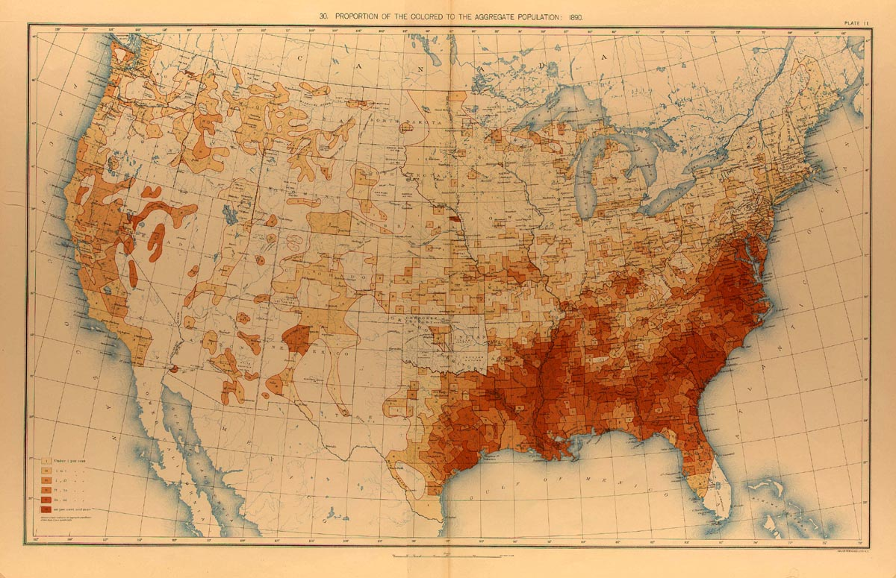
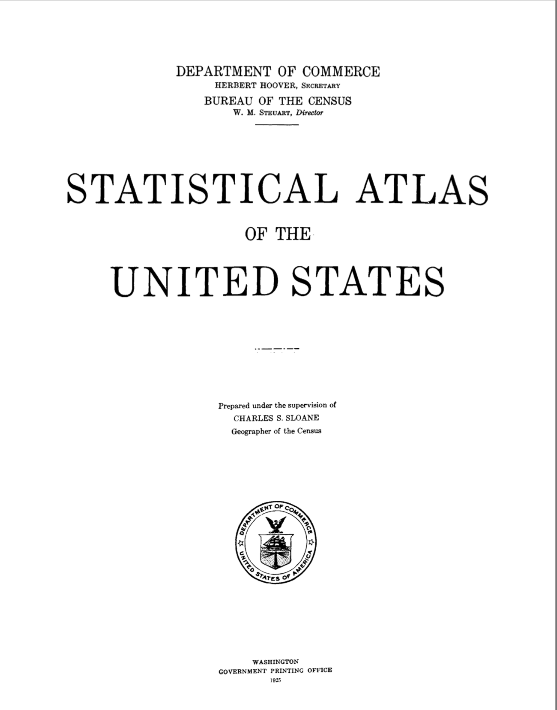
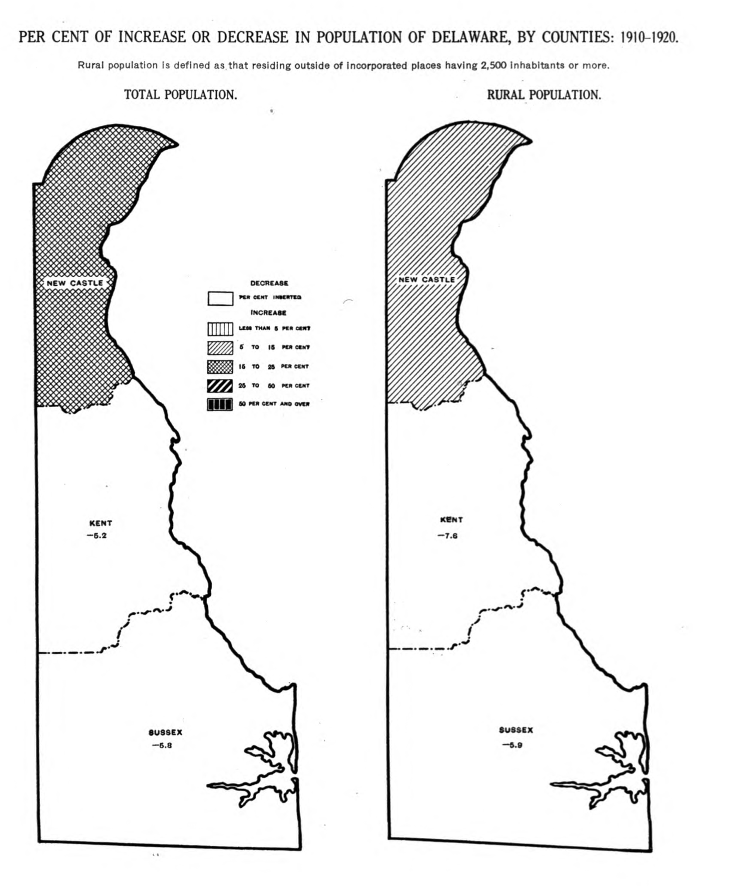
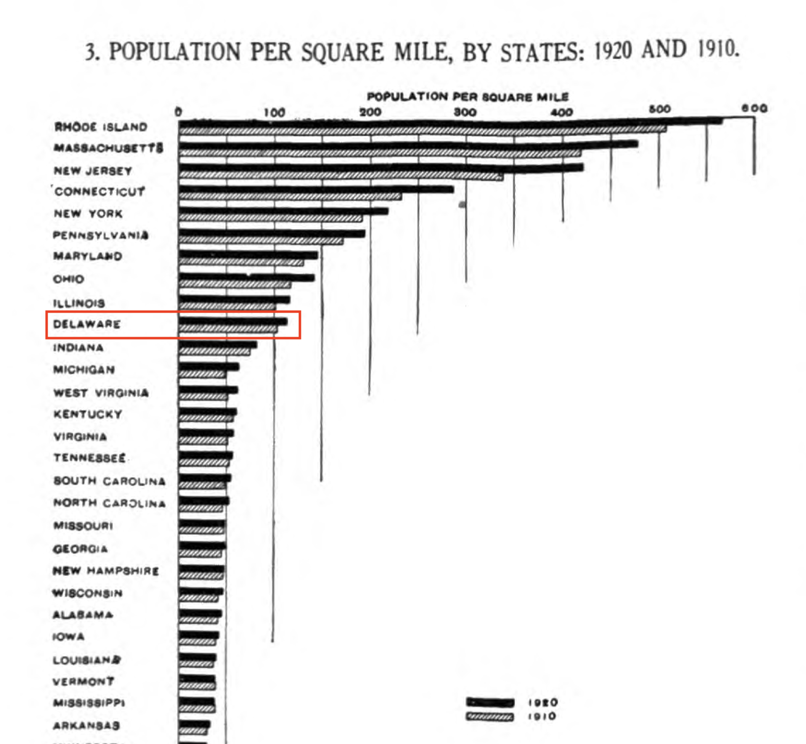
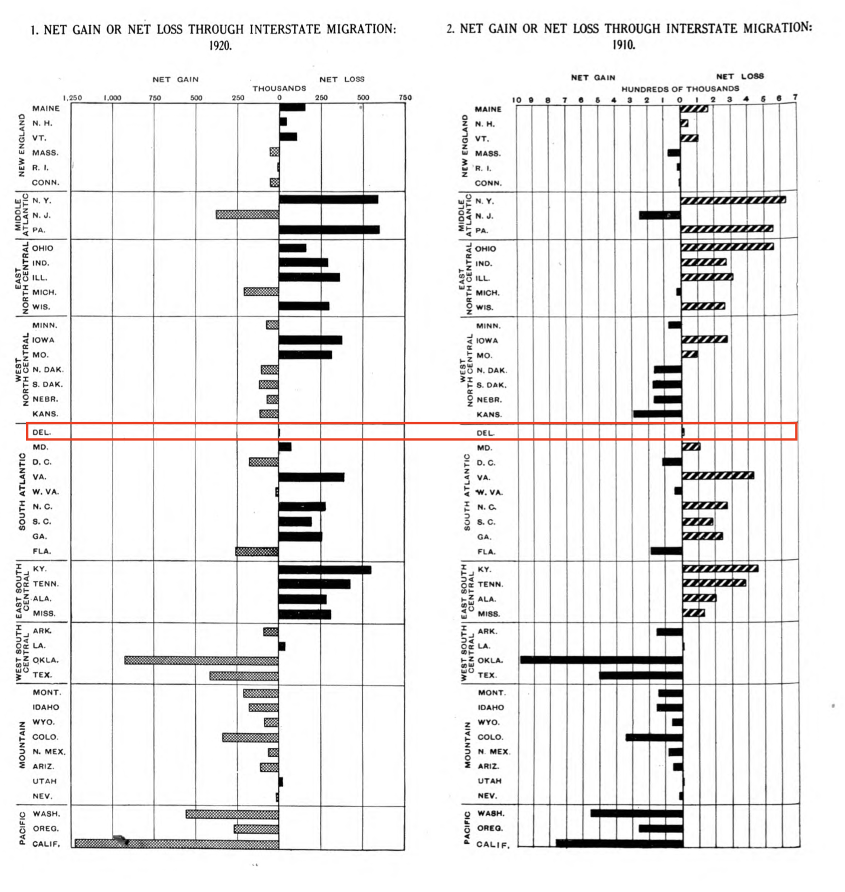

```{r setup, include=FALSE}
knitr::opts_chunk$set(echo = TRUE)
```

# History of the US Census

## US Census Timeline

- bullet 1
- bullet 2

## Data Visualization in the 1800s

```{r, echo=FALSE}

```

## The Statistical Atlas

In fact, up until recently, the Statistical Atlas had been published and released for each Census since 1870! A large compilation of data visualizaitons based on census data:

[1920 Statistical Atlas](https://fraser.stlouisfed.org/files/docs/publications/stat1925/statatlas1925.pdf)

```{r, echo=FALSE, out.width="30%"}

```

## Delaware Population (1920)

```{r, echo=FALSE, out.width="50%", fig.align='center'}

```

## USA Population Density (1920)

```{r, echo=FALSE, out.width="65%", fig.align='center'}

```

## Migration by State (1920)

```{r, echo=FALSE, out.width="60%", fig.align='center'}

```

# Nearly 100 years later, computers make this task MUCH easier...

## Tidycensus Overview

## Variable Search

## Load Var Function

- getting api key

## What is Tidy Data

## Steps Through The Analysis

Load Libraries

```{r, eval=FALSE}
library(tidyverse)
library(sf)
library(tigris)
library(tidycensus)

```

## Looking back: Why was Tidy data useful

* facet
* group_by

## Recreating Maps/Other Analysis


## Next steps
