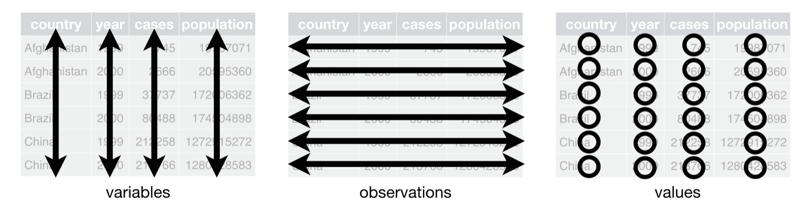

```{r setup, include=FALSE}
knitr::opts_chunk$set(eval = TRUE, dpi = 300, fig.height = 5, fig.align = "center")

options(width = 100)
```

## Agenda

.large[
- History of the U.S. Census

- Getting started with Tidycensus

- Concepts - Tidy Data 

- Step by step analysis  
]
  
  
Follow along to create some cool maps!  

---

## US Census Timeline

- 1790: 6 question survey / U.S. pop just under 4 million
- 1810: Census adds data collection on U.S. manufacturers
- 1849: Congress establishes Census Board
- 1890: Herman Hollerith's tabulation machine used in data collection
- 1900: Census becomes a permant agency and inter-decennial data collection begins
- 1920: For first time, majority of U.S. pop lives in urban areas / U.S. pop over 106 million
- 1940: First use of statistical sampling
- 1960: DIME (Dual Independent Map Encoding)
- 1970: All data products available on magnetic computer tape
- 1980: Mailout / Mailin Surveys
- 2000: U.S. Census asks ten questions
- 2010: American Community Survey 5-year estimates released

---

## Tidycensus Overview

- Developed by Kyle Walker

- [Check out the package on Github!](https://github.com/walkerke/tidycensus)

- Tidycensus is an API wrapper that allows R users to ingest decennial surveys and the American Community Survey (ACS) estimates

- Census data back to the 1990 decennial survey is available

- The defaul in the 5-year ACS estimate from 2013-2017

---

## Getting an API key

- [https://api.census.gov/data/key_signup.html](https://api.census.gov/data/key_signup.html)

- You'll then recieve an e-mail from the census with your API key

```{r, eval=FALSE}
api_key <- "xxxxxxxx"
census_api_key(api_key, install = TRUE)
Sys.getenv("CENSUS_API_KEY")
```

---

## Variable Search

.smalloutput[
```{r}
library(tidycensus)
v17 <- load_variables(2017, "acs5", cache = TRUE)
v17
```
]

---

## Load Var Function

```{r, eval=FALSE}
vt <- get_acs(geography = "county", 
              variables = c(medincome = "B19013_001"), 
              state = "VT")
```

---

## What is Tidy Data?


Three interrelated rules:

1. Each variable must have its own column.
2. Each observation must have its own row.
3. Each value must have its own cell.

```{r, echo=FALSE, out.width="60%", fig.align='center'}

```

  *https://r4ds.had.co.nz/tidy-data.html#fig:tidy-structure* 
  
---

## Why should I care?

R is a vectorized language, meaning you can do operations like:

```{r}
v1 <- c(1, 2, 3, 4)
v2 <- c(5, 6, 7, 8)

v2 - v1
```

instead of writing a *for loop* to subtract the individual elements

The packages inside the tidyverse, e.g `dplyr`, let you do data cleaning and manipulation operations easily when data is in tidy format.

Using these packages can help - write faster and more 'readable' code

---

## Brief concepts - commands you'll see

- **`%>%`** the “pipe” operator for chaining

- **`filter`** to subset a dataframe

- **`group_by`** and then **`summarise`**

- **`facet`** to create *small multiples* plots

- **`left_join`** to join datasets

- and **`<-`** is the assignment operator, more explicit than `=`

---

class: center, middle, inverse

# Let's Start the Analysis!

---

## Setup 

- Install [R](https://www.r-project.org) and [RStudio](https://www.rstudio.com/products/rstudio/download/)
- Download the [Repository](https://github.com/NadiaAntony/census-workshop)

```{r, echo=FALSE, out.width="30%"}

```

 **OR**

* Use this RStudio Cloud workspace: https://rstudio.cloud/project/355872

---

## Package Dependencies

Install packages (if local setup)...

```{r, eval=FALSE}
install.packages("sf")
install.packages("tidycensus")
install.packages("dplyr")
install.packages("ggplot2")
install.packages("tidyr")
install.packages("purrr")
install.packages("lwgeom")
```

... and load libraries

```{r, message=FALSE}
library(dplyr)
library(ggplot2)
library(tidyr)
library(sf)
library(tidycensus)
library(tigris)
library(purrr)
```

---

## Your Choices!

Get an API Key from http://api.census.gov/data/key_signup.html

```{r, eval = FALSE}
census_api_key("<YOUR API KEY>")
demo_variables <- # define the variables you want to analyze here
de_census_data <- get_acs(geography = "tract",
                          state = "DE",
                          variables = demo_variables,
                          geometry = TRUE,
                          cb = TRUE)
```

OR

Load de_census_data.RData

```{r}
load("data/de_census_data.RData")
```

---

## Look at the data

.smalloutput[
```{r}
head(de_census_data)
```
]

---

## Some cleaning using `%>%`

```{r}
de_census_data_clean <- de_census_data %>%
    separate(col = NAME, 
             into = c("Census_Tract", "County", "State"), 
             sep = ",") %>%
    separate(col = Census_Tract, 
             into = c(NA, NA, "Census_Tract_Number"),
             sep = " ") 
```

---

## Using the grammar

Let's read the previous code step by step

.tinyoutput[
```{r}
de_census_data %>% # take the data, and then
    separate(col = NAME, 
             into = c("Census_Tract", "County", "State"), 
             sep = ",") # separate by ','
```
]

---

## Using the grammar (continued)

.tinyoutput[
```{r}
de_census_data %>% # take the data, and then
    separate(col = NAME, 
             into = c("Census_Tract", "County", "State"), 
             sep = ",") %>% # separate, and then
    separate(col = Census_Tract, 
             into = c(NA, NA, "Census_Tract_Number"),
             sep = " ") # separate out Number
# this result is assigned to de_census_data_clean using the assignment operator '<-'
```
]

---

## Creating the Map!

First pick one variable to view estimates

```{r}
# Let's look at the number of foreignborn in each Tract
## create a data frame by subsetting only the 'foreignborn'
de_census_fb <- de_census_data_clean %>%
  filter(variable %in% c("foreignborn"))
```

Now let's plot this:

```{r fb, eval=FALSE}
ggplot(de_census_fb, aes(fill = estimate)) +
  geom_sf() +
  scale_fill_viridis_c() +
  coord_sf(datum = NA) +
  labs(title = "Foreign-Born Estimates by DE Census Tract",
       caption = "Data: 2013-2017 5-year ACS",
       fill = "ACS estimate")
```

---

```{r fb, echo=FALSE}
```

---

## See the individual plot layers

We use the ggplot2 package for **layering** plot info. 
`geom_sf` is used to map the varied shapes (polygons, lines) 

```{r, fig.height=3}
ggplot(de_census_fb, aes(fill = estimate))
```

---

## Add the geometries

```{r, fig.height=4}
ggplot(de_census_fb, aes(fill = estimate)) +
  geom_sf() 
```

---

## Add safe colors

```{r, fig.height=4}
ggplot(de_census_fb, aes(fill = estimate)) +
  geom_sf() +
  scale_fill_viridis_c() 
```

---

## Add the theme and title

```{r, eval=FALSE}
ggplot(de_census_fb, aes(fill = estimate)) +
  geom_sf() +
  scale_fill_viridis_c() +
  coord_sf(crs = 26916, datum = NA) +
  labs(title = "Foreign-Born Estimates by DE Census Tract",
       caption = "Data: 2013-2017 5-year ACS", 
       fill = "ACS estimate")
```

---

```{r fb, echo=FALSE}
```

---

## Subset only Wilmington areas using Tract

```{r}
# Create a dataframe with only Wilmington Tracts 
wilm_census_data <- de_census_data_clean %>%
  filter(Census_Tract_Number %in% c(2, 3, 4, 5, 6.01, 6.02, 
                                    9, 11, 12, 13, 14, 15, 
                                    16, 19.02, 21, 22, 23, 24, 
                                    25, 26, 27, 28, 29, 30.02))

```

Cleaning came of help here to filter out only the relevant numbers

---

## Let's plot EVERYTHING!

```{r, eval=FALSE}
# Plot all our data
ggplot(wilm_census_data, aes(fill = estimate)) +
  geom_sf() +
  scale_fill_viridis_c() +
  coord_sf(crs = 26916, datum = NA) +
  labs(title = "Estimates by Census Tract",
       subtitle = "Wilmington, DE",
       caption = "Data: 2013-2017 5-year ACS
       \nData acquired with the R tidycensus package.",
       fill = "ACS estimate") +
  facet_wrap(~variable)
```

`facet` helps you split up the data by variable and plot each

---

## What's the problem?

```{r, echo=FALSE, fig.width=8}
# Plot all our data
ggplot(wilm_census_data, aes(fill = estimate)) +
  geom_sf() +
  scale_fill_viridis_c() +
  scale_color_viridis_c(guide = FALSE) +
  coord_sf(crs = 26916, datum = NA) +
  labs(title = "Estimates by Census Tract",
       subtitle = "Wilmington, DE",
       caption = "Data: 2013-2017 5-year ACS
       \nData acquired with the R tidycensus package.",
       fill = "ACS estimate") +
  facet_wrap(~variable, nrow = 2)
```

---

## Plotting some comparable variables

Let's focus on the race variables

```{r}
## create a data frame with race variables
wilm_census_race <- wilm_census_data %>%
  filter(variable %in% c("hispanic", "black", "asian", "white"))
```

```{r race, eval=FALSE}
## plot 
ggplot(wilm_census_race, aes(fill = estimate)) +
  geom_sf() +
  scale_fill_viridis_c() +
  coord_sf(crs = 26916, datum = NA) +
  labs(title = "Population Estimates",
       subtitle = "Wilmington, DE",
       fill = "ACS estimate") +
  facet_wrap(~variable)
```

---

```{r race, echo=FALSE}
```

---

## Comparing a better way

'Small multiples plots' are useful to compare between variables.
But we need to make sure we compare the right proportions so as to not let people take away a wrong insight.

Let's do some data aggregation and data joins to find the percentages within each tract.

---

## Code

Create the total population data frame 

```{r}
## Estimate the total population 
## by summing up the different race estimates
wilm_tract_pop <- wilm_census_race %>%
  group_by(Census_Tract_Number) %>%
  summarise(Population_Estimate = sum(estimate))
```
```{r}
# remove geometry variable to make it a regular dataset
st_geometry(wilm_tract_pop) <- NULL 
```

Join the total population data with the original and create the Percentage column
```{r}
# create data frame with the percentages
wilm_tract_percpop <- wilm_census_race %>%
  left_join(wilm_tract_pop, by = "Census_Tract_Number") %>%
  mutate(Percentage = estimate/Population_Estimate)
```

---

## Step by Step

Highlight sections and run using `cmd` + `return` to see the separate steps. Remember not to highlight the variable assignment part.

.tinyoutput[
```{r}
wilm_census_race %>%
  group_by(Census_Tract_Number) 
```
]

---

.tinyoutput[
```{r}
wilm_census_race %>%
  group_by(Census_Tract_Number) %>%
  summarise(Population_Estimate = sum(estimate))
```
]
---

.tinyoutput[
```{r}
wilm_census_race %>%
  left_join(wilm_tract_pop, by = "Census_Tract_Number") 
```
]

---

.tinyoutput[
```{r}
wilm_census_race %>%
  left_join(wilm_tract_pop, by = "Census_Tract_Number") %>%
  mutate(Percentage = estimate/Population_Estimate)
```
]

Note: `tidycensus` allows you to get the summary value through the API as well!

---

## Plot the percentage 

```{r percpop, eval=FALSE}
ggplot(wilm_tract_percpop, aes(fill = Percentage)) +
  geom_sf() +
  scale_fill_viridis_c() +
  coord_sf(crs = 26916, datum = NA) +
  labs(title = "Percentage of Total (Estimates) by Census Tract",
       subtitle = "Wilmington, DE",
       fill = "ACS estimate") +
  facet_wrap(~variable)
```

---

```{r percpop, echo=FALSE}
```

---

## Your Turn

You can create a Wilmington Education variable by filtering 
`c("high_school_diplomas", "bachelor_degrees", "masters_degrees")` variables
and recreating the previous visualizations:

- Count estimates by census tract
- Percentage estimates by census tract

---

## Answer

```{r, eval=FALSE}
wilm_census_edu <- wilm_census_data %>%
  filter(variable %in% c("high_school_diplomas", 
                         "bachelor_degrees", 
                         "masters_degrees"))

ggplot(wilm_census_edu, aes(fill = estimate)) +
  geom_sf() +
  scale_fill_viridis_c() +
  coord_sf(crs = 26916, datum = NA) +
  labs(title = "Education Estimates",
       subtitle = "Wilmington, DE",
       fill = "ACS estimate") +
  facet_wrap(~variable)
```

---

```{r, eval=FALSE}
# As a percentage of education data available 
# (or use total population)
wilm_tract_totedu <- wilm_census_edu %>%
  group_by(Census_Tract_Number) %>%
  summarise(Education_Estimate = sum(estimate))

st_geometry(wilm_tract_totedu) <- NULL # remove geometry

wilm_tract_percedu <- wilm_tract_totedu %>%
  left_join(wilm_census_edu, by = "Census_Tract_Number") %>%
  mutate(Percentage = estimate/Education_Estimate)

# Plot
ggplot(wilm_tract_percedu, aes(fill = Percentage)) +
  geom_sf() +
  scale_fill_viridis_c() +
  coord_sf(crs = 26916, datum = NA) +
  labs(title = "Percentage of Education Estimates by Census Tract",
       subtitle = "Wilmington, DE",
       fill = "ACS estimate") +
  facet_wrap(~variable)
```

---

## Dot Density Plots

Choropleth maps have a tendency of being misunderstood due to the *area* covered by a color. 
We can plot dots in order to avoid the issue of misrepresentation of sparsely populated areas and give an idea of density. 

Hold tight as this will have some heavy lifting with functions from dplyr and purrr!

```{r, message=FALSE}
wm_dots <- map(c("white", "black", 
                 "asian", "hispanic"), function(group) {
    wilm_census_data %>%
        filter(variable == group) %>%
        st_sample(., size = .$estimate / 10, exact = FALSE) %>%
        st_sf() %>%
        mutate(group = group) 
}) %>%
    reduce(rbind) %>%
    group_by(group) %>%
    summarize()
```

---

`map()` Applys a function to each element of a vector, in our case the vector is the race values.
i.e, for each race we subset the wilmington data, and create dots representing the population in each tract.

```{r, eval=FALSE}
# for each group 
group <- "asian"
wilm_census_data %>%
        filter(variable == group) %>%
        st_sample(., size = .$estimate / 10, exact = FALSE) %>%
        st_sf() %>%
        mutate(group = group)
```

- `st_sample()` generates a sample of random dots each one representing 10 people. 
- `st_sf()` converts the POINT geometry set back to simple features dataframe.

---

## Plotting it all together

```{r, fig.height=3}
ggplot() + 
    geom_sf(data = wilm_census_data, color = "grey95", fill = "white") + 
    geom_sf(data = wm_dots, aes(color = group, fill = group), 
            size = 0.1, alpha = 0.5) +
    theme_minimal()
```

---

## Looking back

Data being tidy allowed us to immediately use commands like:

* facet
* group_by

Remember ACS are estimates so we should consider the MOE or Margin of Error variable. 

---

## Next steps

- Try using another layer with alpha to show the MOE [*](https://www.cdc.gov/dhdsp/maps/gisx/training/module4/files/4_mapping_uncertainty_module-508.pdf)
- Integrate this data with statistics from the Uniform Crime Reporting database
- Ask interesting questions and use tidy functions to get quick results
  - What are the high median rent areas?
  - Does the median house value correlate with houses earning above 200k?
  - Among the high median house value ones what is the percentage of owners to renter?
  - Does more Education level imply more Median income?
  - Where are the Vacant houses and what is the median income in these areas?
  
---

class: center, middle, inverse

# Thank You!
